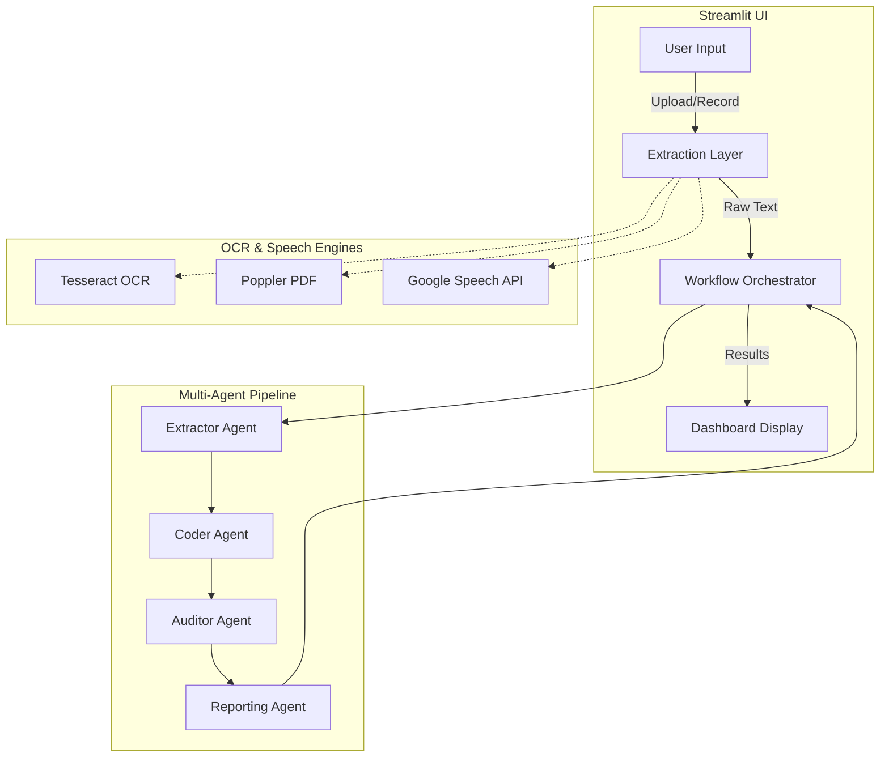

# MediCode AI: System Architecture & Workflow

MediCode AI is a multi-agent healthcare workflow designed to automate medical billing and coding. It uses a combination of OCR, Speech-to-Text, and LLM-powered agents to transform clinical transcripts into verified ICD-10 billing codes.

## 🏗️ High-Level Architecture

The system is divided into a **Streamlit Frontend** and a **Modular Agentic Backend**.



---

## 🔄 Architectural Flow

### 1. Input & Data Extraction
The user provides clinical data through several channels:
- **Documents**: PDF, DOCX, TXT.
- **Images**: Scanned medical reports (PNG, JPG).
- **Voice**: Live recording or uploaded audio files (WAV, MP3).

The **Extraction Layer** in `app.py` uses:
- `pytesseract` for Image OCR.
- `pdf2image` for PDF processing.
- `SpeechRecognition` & `pydub` for audio transcription.

### 2. Agentic Workflow (Backend)
Once the raw transcript is ready, it is passed to the `MedicalCodingWorkflow` which manages the following sequence:

| Phase | Agent | Responsibility |
| :--- | :--- | :--- |
| **Extraction** | `ExtractorAgent` | Identifies clinical entities (Diagnoses, Symptoms, Procedures, Medications) from the raw text. |
| **Coding** | `CoderAgent` | Maps the identified diagnoses to their corresponding **ICD-10-CM** billing codes. |
| **Auditing** | `AuditorAgent` | Validates the codes against the original transcript to ensure no hallucinations or mismatches. Calculates confidence scores. |
| **Reporting** | `ReportingAgent` | Formats the final results into a structured JSON/Dictionary format suitable for the UI. |

### 3. Intelligence Dashboard (Frontend)
The final results are returned to the Streamlit UI which provides:
- **Metrics**: Quick count of diagnoses and billing codes.
- **Clinical Entity Tags**: Color-coded visualization of extracted medical data.
- **ICD-10 Billing Table**: Interactive table showing the status (Approved/Pending/Rejected) of each code.
- **Exporting**: Options to download the results as a CSV/Excel report.

---

## 🛠️ Technology Stack
- **Frontend**: Streamlit
- **Agent Framework**: Custom Python Class-based Agents (LangChain integration ready)
- **OCR**: Tesseract OCR
- **Speech**: Google Speech Recognition
- **Data Handling**: Pandas, OpenPyXL
- **Audio Processing**: Pydub (FFmpeg dependent)

---

## 📁 Project Structure
```text
AI-Agent/
├── backend/
│   ├── agents/            # Individual specialized agents
│   │   ├── extractor.py   # Clinical Entity Recognition
│   │   ├── coder.py       # ICD-10 Mapping logic
│   │   ├── auditor.py     # Accuracy & Validation
│   │   └── reporter.py    # Formatting & Summary
│   └── main_workflow.py   # Orchestration logic
├── frontend/
│   └── app.py             # Streamlit UI & Data Extraction
├── data/                  # Sample documents for testing
├── requirements.txt       # Project dependencies
└── .venv/                 # Python Virtual Environment
```
